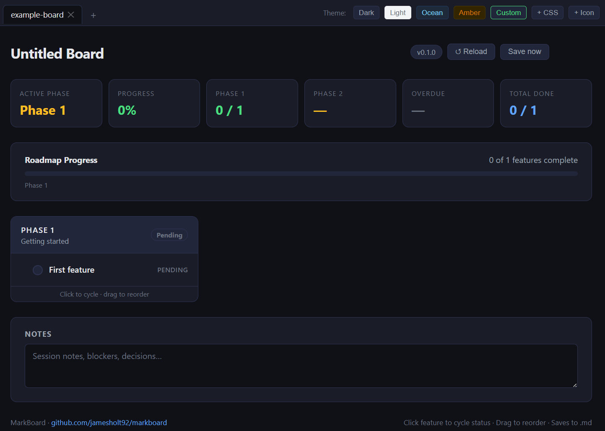
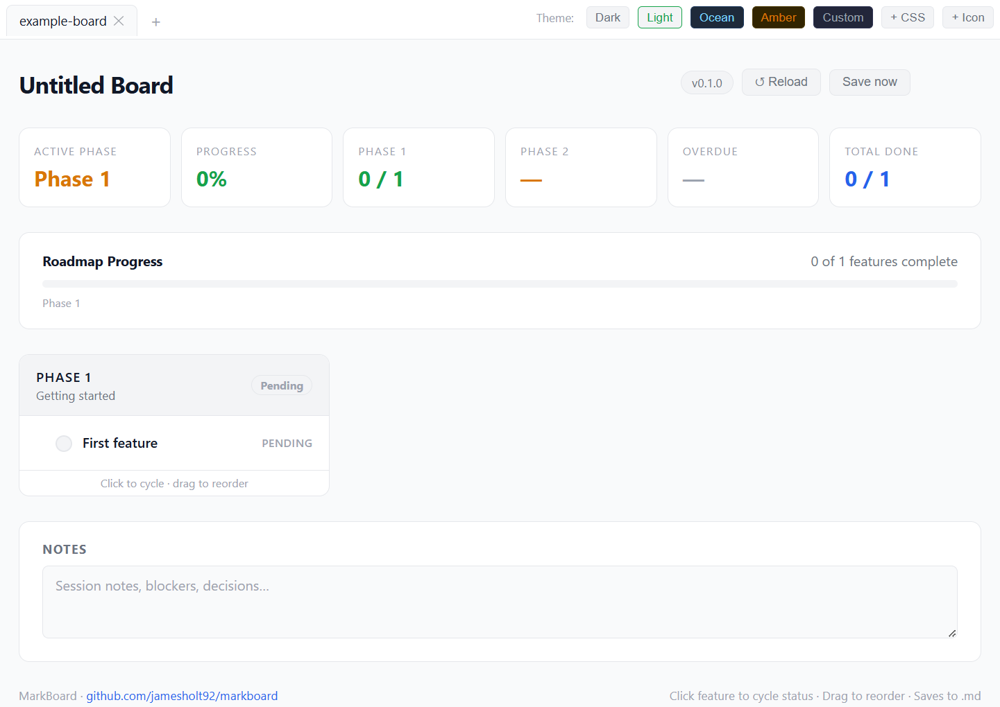

# MarkBoard

A plain-text project tracker powered by Markdown. Your board data lives in a `.md` file you own — version-controllable, human-readable, and editable in any text editor. The `index.html` file provides a visual board that reads and writes it directly.

No server. No database. No accounts. One HTML file + one Markdown file.





---

## Quick start

1. Download `index.html`
2. Open it in Chrome or Edge (86+)
3. Click **Open board** and pick the **folder** containing your `.md` file (or try `example.md` from this repo)
4. Changes you make in the board write back to the file automatically

---

## Markdown format

```markdown
# Board Title

<!-- meta: version=1.0 updated=2026-01-01 tests=42 -->

## Phase Name | done
<!-- sub: Optional subtitle or date range -->
- [x] Done feature :: Optional description
- [~] In-progress feature :: Description [2026-04-15]
- [ ] Pending feature

## Another Phase | active
<!-- sub: Current phase -->
- [ ] Feature with due date :: Description [2026-06-01]
- [ ] Feature without due date

## Notes

Free text notes here. Saved automatically.
```

### Feature status markers

| Marker | Status      |
|--------|-------------|
| `[x]`  | Done        |
| `[~]`  | In progress |
| `[ ]`  | Pending     |

### Phase status

Append `| done`, `| active`, or `| pending` to any `##` heading. The board will auto-derive this from its features when you click — but you can also set it manually in the file.

### Due dates

Add `[YYYY-MM-DD]` at the end of a feature line (after the description). The board colour-codes them:

- **Red** — overdue
- **Amber** — due within 7 days
- **Grey** — future
- **Strikethrough** — done (date preserved for reference)

### Meta comment

The `<!-- meta: key=value ... -->` comment is optional. Recognised keys:

| Key       | Description                        |
|-----------|------------------------------------|
| `version` | Shown in the board header          |
| `updated` | Auto-updated on every save         |
| `tests`   | Shown in the stats bar             |

---

## Features

- **Multiple boards** — open several project folders as tabs, switch between them
- **Click to cycle** — click any feature to cycle pending → active → done
- **Drag to reorder** — drag features within a phase, or drag phases to reorder
- **Due dates** — colour-coded overdue/soon/future badges
- **5 themes** — Dark, Light, Ocean, Amber, plus **custom CSS** (global override via + CSS)
- **Favicon** — built-in default; override globally via **+ Icon** or per-project via `.mbconfig`
- **Project plugins** — drop a `.mbconfig/` folder next to your `.md` file; `favicon.svg` and `theme.css` inside are loaded automatically when you open that project
- **Auto-save** — every status change writes back to the `.md` file immediately
- **Notes field** — free-text area saved to the `## Notes` section
- **Zero dependencies** — single HTML file, works offline

---

## Keyboard shortcuts

| Shortcut | Action |
|----------|--------|
| `Ctrl+S` / `Cmd+S` | Save the active board immediately |
| `Ctrl+Tab` / `Cmd+Tab` | Switch to the next open board tab |
| `Ctrl+Shift+Tab` / `Cmd+Shift+Tab` | Switch to the previous open board tab |
| `Enter` / `Space` | Cycle status on the focused feature (keyboard navigation) |

---

## Project plugins (.mbconfig)

Place a `.mbconfig/` folder next to your `.md` file. When you open the project folder in MarkBoard, any supported files inside are loaded automatically:

```
my-project/
  board.md
  .mbconfig/
    favicon.svg   ← custom favicon (also: .png, .ico, .jpg)
    theme.css     ← custom CSS theme
```

Plugins are **per-project**: switching between board tabs applies each board's own `.mbconfig`. When no board is open, global overrides (see below) take effect.

---

## Custom themes

**Per-project**: put `theme.css` in `.mbconfig/` — loaded automatically when you open that project folder.

**Global override**: click **+ CSS** in the theme bar and pick any `.css` file. Remembered across sessions via `localStorage`.

The theme format is a single CSS block targeting `[data-theme="custom"]`:

```css
/* theme.css */
[data-theme="custom"] {
  --bg:          #1e1e2e;
  --surface:     #181825;
  --surface2:    #313244;
  --border:      #45475a;
  --accent:      #a6e3a1;
  --accent-dim:  #1e3a2e;
  --accent2:     #fab387;
  --accent2-dim: #3d2010;
  --blue:        #89b4fa;
  --red:         #f38ba8;
  --muted:       #6c7086;
  --text:        #cdd6f4;
  --text-dim:    #a6adc8;
  --radius:      10px;
}
```

Any omitted variables fall back to the dark theme. You can also include arbitrary CSS rules to customise individual components. To reset the global override, call `clearCustomTheme()` in the browser console.

---

## Custom favicon

**Per-project**: put `favicon.svg` (or `.png`, `.ico`, `.jpg`) in `.mbconfig/` — loaded automatically.

**Global override**: click **+ Icon** in the theme bar and pick any image file. Remembered across sessions via `localStorage`. To reset, call `clearFavicon()` in the browser console.

---

## Requirements

Chrome or Edge 86+ (uses the [File System Access API](https://developer.mozilla.org/en-US/docs/Web/API/File_System_API) to read and write local files). Firefox does not support this API.

---

## Using with version control

Because your board data is a plain `.md` file, you can commit it alongside your code:

```bash
git add tracker.md
git commit -m "docs: mark search feature as done"
```

Diffs are human-readable. You get a full history of your project progress.

The `.mbconfig/` folder can be committed too, so your favicon and theme travel with the repo:

```
.gitignore
board.md
.mbconfig/
  favicon.svg
  theme.css
```

---

## AI usage disclosure

Parts of this project were developed with the assistance of AI coding tools (Claude by Anthropic). All AI-generated code has been reviewed, tested, and is the responsibility of the project maintainers.

---

## License

MIT — see [LICENSE](LICENSE)
